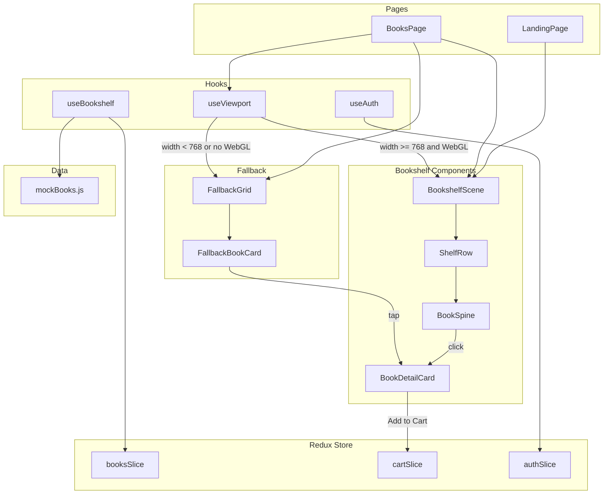

# Design Document: Interactive Bookshelf

## Overview

The Interactive Bookshelf feature replaces the existing placeholder BooksPage and enhances the LandingPage with a 3D vintage wooden bookshelf built using React Three Fiber (`@react-three/fiber`) and `@react-three/drei`. Books are rendered as colored 3D spines organized by category across horizontal shelf rows. Unauthenticated visitors see a static, non-interactive version as a decorative hero element. Authenticated users get full interactivity: clicking a spine opens a detail card with title, author, price, cover, category, and an "Add to Cart" button. On viewports below 768px or when WebGL is unavailable, the experience falls back to a responsive 2D Tailwind CSS grid. A static mock data store of 20–30 books across 4–5 categories drives the shelf until the Django backend is integrated.

### Key Design Decisions

| Decision | Choice | Rationale |
|----------|--------|-----------|
| 3D Library | React Three Fiber + drei | Already used in Auth3DBook component; first-class React integration, declarative API |
| State Management | Existing Redux store (booksSlice, cartSlice) | Project already uses @reduxjs/toolkit; avoids new dependencies |
| Fallback Strategy | Viewport hook + WebGL detection | Clean separation; fallback component shares data layer with 3D view |
| Mock Data Location | Static JSON imported into Redux on init | Simple, deterministic; easy to swap for API thunk later |
| Lazy Loading | React.lazy + Suspense | Already used in routes/index.jsx; consistent pattern |

## Architecture



### Component Hierarchy

```
BooksPage
├── useViewport() → decides 3D vs fallback
├── <Suspense fallback={<LoadingSpinner />}>
│   └── <BookshelfScene /> (lazy-loaded)
│       ├── Lighting (ambient + directional)
│       ├── ShelfStructure (wood-grain shelves)
│       └── ShelfRow[] (one per category)
│           ├── CategoryLabel
│           └── BookSpine[] (left-to-right)
└── <FallbackGrid /> (when viewport < 768px or no WebGL)
    └── CategorySection[]
        └── FallbackBookCard[]

BookDetailCard (portal/overlay, shared by both views)
├── Cover Image
├── Title, Author, Category, Price
├── Add to Cart Button
└── Close (click-outside / Escape)
```

## Components and Interfaces

### BookshelfScene

The root 3D canvas component. Lazy-loaded via `React.lazy`.

```jsx
// Props
interface BookshelfSceneProps {
  books: Book[];              // Grouped by category inside component
  interactive: boolean;       // false on landing page, true on books page
  onBookSelect: (book: Book) => void;
}
```

Responsibilities:
- Renders `<Canvas>` with camera positioned to show all shelf rows
- Sets up ambient light (warm tone) and directional light (simulated window)
- Renders shelf wood structure and one `<ShelfRow>` per category
- Applies non-interactive overlay (reduced opacity + blur) when `interactive=false`

### ShelfRow

A horizontal shelf that holds books of a single category.

```jsx
interface ShelfRowProps {
  category: string;
  books: Book[];
  yPosition: number;          // Vertical placement in the scene
  interactive: boolean;
  onBookSelect: (book: Book) => void;
}
```

Responsibilities:
- Renders wood-textured shelf plank mesh
- Renders a 3D text label for the category name
- Maps books to `<BookSpine>` in left-to-right order

### BookSpine

A single 3D book mesh on the shelf.

```jsx
interface BookSpineProps {
  book: Book;
  xPosition: number;
  interactive: boolean;
  onSelect: (book: Book) => void;
}
```

Responsibilities:
- Renders a box geometry with thickness based on `book.pageCount`
- Applies a color from the spine color palette
- Renders title text on the spine face
- On hover (when interactive): scales up slightly and applies emissive glow
- On click (when interactive): calls `onSelect`

### BookDetailCard

An HTML overlay (not 3D) that appears above the canvas.

```jsx
interface BookDetailCardProps {
  book: Book;
  onClose: () => void;
  onAddToCart: (book: Book) => void;
}
```

Responsibilities:
- Displays title, author, price, cover image, category
- Positions itself near the clicked spine without overflowing viewport
- "Add to Cart" button dispatches `addItem` to the cart Redux slice
- Closes on outside click or Escape key

### FallbackGrid

A 2D responsive grid shown on small screens or when WebGL is absent.

```jsx
interface FallbackGridProps {
  books: Book[];
  onBookSelect: (book: Book) => void;
}
```

Responsibilities:
- Groups books by category
- Renders category headings
- Renders cards in a responsive Tailwind grid (`grid-cols-2 sm:grid-cols-3`)
- Tapping a card opens `BookDetailCard`

### useViewport Hook

```js
function useViewport(): { width: number; isMobile: boolean; hasWebGL: boolean }
```

- Returns current viewport width
- `isMobile`: true when width < 768px
- `hasWebGL`: tests `document.createElement('canvas').getContext('webgl')` on mount

### useBookshelf Hook

```js
function useBookshelf(): {
  books: Book[];
  booksByCategory: Record<string, Book[]>;
  categories: string[];
  selectedBook: Book | null;
  selectBook: (book: Book) => void;
  clearSelection: () => void;
  loading: boolean;
}
```

- On mount, loads mock data into Redux booksSlice if items are empty
- Derives `booksByCategory` from the flat list using `useMemo`
- Exposes selection state for the detail card

### LoadingSpinner

A centered spinner component using the application's primary color, shown in `<Suspense>` while `BookshelfScene` loads.

## Data Models

### Book (Mock Data Shape)

```js
/**
 * @typedef {Object} Book
 * @property {string} id           - Unique identifier (UUID-style string)
 * @property {string} title        - Book title
 * @property {string} author       - Author full name
 * @property {number} price        - Price in USD (e.g., 14.99)
 * @property {string} coverImageUrl - URL to a placeholder cover image
 * @property {string} category     - Category name (e.g., "Science Fiction")
 * @property {number} pageCount    - Number of pages (used for spine thickness)
 */
```

### Mock Data Store Structure

```js
// src/data/mockBooks.js
export const MOCK_BOOKS = [
  {
    id: "b1",
    title: "Dune",
    author: "Frank Herbert",
    price: 12.99,
    coverImageUrl: "https://picsum.photos/seed/dune/200/300",
    category: "Science Fiction",
    pageCount: 412,
  },
  // ... 20-30 entries across 4-5 categories
];

export const BOOK_CATEGORIES = ["Science Fiction", "Fantasy", "Mystery", "Non-Fiction", "Classic Literature"];
```

### Spine Color Palette

```js
// src/constants/bookColors.js
export const SPINE_COLORS = [
  '#8B4513', '#2E4057', '#6B3A2A', '#4A5568',
  '#9B2335', '#2D5016', '#5B3A6A', '#B8860B',
  '#1E3A5F', '#704214', '#3D5C3A', '#8B1A4A',
];
```

### Redux State Shape (books slice extension)

```js
// booksSlice initial state (extended)
{
  items: Book[],         // All books from mock data
  selected: Book | null, // Currently selected book for detail card
  loading: boolean,
  error: string | null,
}
```

### Cart Item Shape

```js
/**
 * @typedef {Object} CartItem
 * @property {string} id       - Same as Book.id
 * @property {string} title    - Book title
 * @property {number} price    - Unit price
 * @property {number} quantity - Number of copies (defaults to 1)
 */
```

## Correctness Properties

*A property is a characteristic or behavior that should hold true across all valid executions of a system — essentially, a formal statement about what the system should do. Properties serve as the bridge between human-readable specifications and machine-verifiable correctness guarantees.*

### Property 1: Category grouping invariant

*For any* array of book objects with varying categories, the `groupBooksByCategory` function SHALL produce exactly one group key per distinct category present in the input, and the union of all books across groups SHALL equal the original input set (no books lost or duplicated).

**Validates: Requirements 4.1, 4.4, 6.3**

### Property 2: Book detail card data completeness

*For any* book object from the data store, when selected for display, the resulting detail card data SHALL contain all required fields: title, author, price, coverImageUrl, and category — each non-empty and matching the source book's values.

**Validates: Requirements 3.1, 6.4**

### Property 3: Spine color assignment from palette

*For any* book rendered as a BookSpine, the assigned spine color SHALL be a member of the predefined SPINE_COLORS palette array.

**Validates: Requirements 5.2**

### Property 4: Spine thickness proportional to page count

*For any* two books with distinct pageCount values, the computed spine thickness SHALL be different, and a book with a higher pageCount SHALL have a greater thickness than a book with a lower pageCount.

**Validates: Requirements 5.5**

### Property 5: Viewport threshold determines render mode

*For any* viewport width value, if the width is below 768 the `useViewport` hook SHALL report `isMobile: true`, and if the width is 768 or above it SHALL report `isMobile: false`.

**Validates: Requirements 6.1**

### Property 6: Mock data schema validity

*For any* book object in the MOCK_BOOKS array, it SHALL contain all required fields (id, title, author, price, coverImageUrl, category, pageCount) where id/title/author/category are non-empty strings, price is a positive number, pageCount is a positive integer, and coverImageUrl is a valid URL string.

**Validates: Requirements 7.3, 7.4**

## Error Handling

| Scenario | Handling Strategy | User Experience |
|----------|-------------------|----------------|
| WebGL not available | `useViewport` detects via canvas context check; sets `hasWebGL: false` | FallbackGrid renders seamlessly, no error shown |
| BookshelfScene fails to load (chunk error) | React Error Boundary wraps the lazy component; catches load failure | FallbackGrid shown as recovery; optional toast "3D view unavailable" |
| React Three Fiber render error | Error Boundary around `<Canvas>` catches runtime 3D errors | FallbackGrid shown; error logged to console |
| Invalid book data (missing fields) | `useBookshelf` filters books with incomplete data before rendering | Incomplete books excluded silently; console warning in dev mode |
| Image URL fails to load | `` `onError` handler replaces with a generic book cover placeholder | Placeholder cover image shown |
| Add to Cart with no auth | Button only rendered when user is authenticated (BookDetailCard only appears for auth users) | Non-authenticated users never see the button |
| Viewport resize during interaction | `useViewport` listens to resize; if crossing 768px threshold, re-renders appropriate view | BookDetailCard closes on view switch; user sees the new layout |
| Escape key / click-outside on detail card | Event listener on `keydown` for Escape; click-outside via `useRef` and `mousedown` | Card dismisses cleanly |

### Error Boundary Implementation

```jsx
// Wraps BookshelfScene to catch 3D rendering errors
<ErrorBoundary fallback={<FallbackGrid books={books} onBookSelect={selectBook} />}>
  <Suspense fallback={<LoadingSpinner />}>
    <BookshelfScene books={books} interactive={true} onBookSelect={selectBook} />
  </Suspense>
</ErrorBoundary>
```

## Testing Strategy

### Unit Tests (Example-Based)

| Test | What it verifies |
|------|------------------|
| BookDetailCard renders all fields | Given a specific book, card shows title, author, price, image, category |
| BookDetailCard closes on Escape | Pressing Escape triggers onClose callback |
| BookDetailCard closes on outside click | Clicking outside triggers onClose callback |
| Add to Cart dispatches action | Clicking button dispatches `addItem` with correct payload |
| LoadingSpinner uses primary colors | Spinner component references COLORS.primary |
| FallbackGrid renders category headings | Given books in 3 categories, renders 3 heading elements |
| BookshelfScene applies overlay when non-interactive | interactive=false applies opacity/blur |
| WebGL detection returns false when unavailable | Mocked canvas context returns null → hasWebGL is false |
| Authenticated redirect from landing | Auth user on "/" gets redirected to "/books" |

### Property-Based Tests

**Library**: [fast-check](https://github.com/dubzzz/fast-check) (JavaScript PBT library, well-suited for React/Vite projects)

**Configuration**: Minimum 100 iterations per property test.

| Property Test | Tag |
|---------------|-----|
| Category grouping invariant | Feature: interactive-bookshelf, Property 1: Category grouping invariant |
| Book detail card data completeness | Feature: interactive-bookshelf, Property 2: Book detail card data completeness |
| Spine color assignment from palette | Feature: interactive-bookshelf, Property 3: Spine color assignment from palette |
| Spine thickness proportional to page count | Feature: interactive-bookshelf, Property 4: Spine thickness proportional to page count |
| Viewport threshold determines render mode | Feature: interactive-bookshelf, Property 5: Viewport threshold determines render mode |
| Mock data schema validity | Feature: interactive-bookshelf, Property 6: Mock data schema validity |

### Integration Tests

| Test | What it verifies |
|------|------------------|
| Full app renders BookshelfScene for authenticated desktop user | Route /books with auth + wide viewport shows 3D scene |
| Full app renders FallbackGrid for mobile user | Route /books with narrow viewport shows 2D grid |
| Mock data loads into Redux on initialization | After app mount, store.books.items has 20-30 entries |
| Book selection flow end-to-end | Click spine → detail card appears → Add to Cart → cart slice updated |

### Test File Structure

```
src/
├── data/
│   └── __tests__/
│       └── mockBooks.property.test.js    (Properties 1, 6)
├── hooks/
│   └── __tests__/
│       └── useViewport.property.test.js  (Property 5)
├── components/
│   └── Bookshelf/
│       └── __tests__/
│           ├── BookshelfScene.test.jsx
│           ├── BookDetailCard.test.jsx
│           ├── spineUtils.property.test.js (Properties 3, 4)
│           └── groupBooks.property.test.js (Property 1)
│   └── FallbackGrid/
│       └── __tests__/
│           └── FallbackGrid.test.jsx
└── pages/
    └── Books/
        └── __tests__/
            └── BooksPage.test.jsx
```

### New Dependencies Required

```json
{
  "@react-three/fiber": "^8.x",
  "@react-three/drei": "^9.x",
  "three": "^0.160.x"
}
```

Dev dependencies for testing:
```json
{
  "vitest": "^1.x",
  "@testing-library/react": "^14.x",
  "@testing-library/jest-dom": "^6.x",
  "fast-check": "^3.x"
}
```

